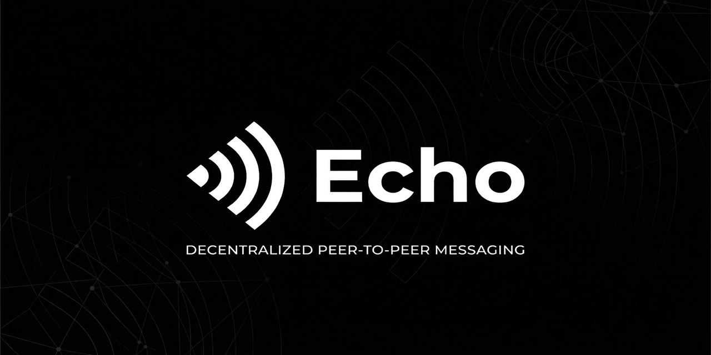

<p align="center">
  
</p>

<p align="center">
  
</p>

<h1 align="center">Echo</h1>

<p align="center">
Decentralized Peer-to-Peer Messaging
</p>

<p align="center">
No phone number • No servers • End-to-end encryption
</p>

<p align="center">
  
  
  
  
</p>

---

## Overview

Echo is a decentralized messaging application where no company owns your data, no central server stores your conversations, and no intermediary can read your messages.

Communication happens directly between devices using peer-to-peer networking and strong end-to-end encryption.

Echo combines WebRTC, IPFS and Ethereum to create a messaging system that works without centralized infrastructure.

---

## Why Echo Exists

Most messaging platforms rely on centralized servers.

Messages pass through infrastructure owned by corporations.
Data can be stored, analyzed or accessed through legal requests.

Service outages also affect millions of users simultaneously.

In October 2021, the global Facebook outage disconnected approximately **3.5 billion users** from WhatsApp, Instagram and Facebook for nearly six hours.

Echo explores a different architecture where communication happens **directly between users instead of through a central platform**.

---

## Key Properties

• No phone number login
• No email registration
• Passphrase-based identity
• Direct device-to-device messaging
• End-to-end encryption
• Offline delivery via IPFS
• No centralized message servers
• Works in any modern browser

---

## Project Status

Echo is currently under active development.

Completed

• Passphrase identity system
• Username and profile setup
• Smart contract username registry

In progress

• WebRTC peer-to-peer messaging
• IPFS offline message delivery

Planned

• File and image sharing
• GitHub Pages deployment
• Mobile browser optimization

---

## How Echo Works

```
User opens Echo
→ Generates 12-word passphrase
→ Derives public/private key pair
→ Sets username

Username registered on Ethereum
→ Other users search by username

If both users are online
→ WebRTC creates direct encrypted connection

If recipient is offline
→ Message encrypted locally
→ Stored on IPFS
→ Retrieved and decrypted when recipient reconnects
```

Messages never pass through a central server.

---

## Architecture

```
[User A Device]                    [User B Device]
      |                                  |
      |-------- WebRTC Direct ---------->|   (online)
      |                                  |
      |----> IPFS Storage                |   (offline)
                  |                      |
                  |<---- Fetch on login--|

[Ethereum Sepolia]
      |
      |---- Username → Public Key mapping
```

WebRTC handles real-time communication.
IPFS provides decentralized storage for offline delivery.
Ethereum stores only identity mappings.

---

## Tech Stack

| Layer          | Technology                  |
| -------------- | --------------------------- |
| Frontend       | HTML, CSS, JavaScript       |
| Identity       | BIP-39 Mnemonics, ethers.js |
| Encryption     | TweetNaCl.js                |
| Smart Contract | Solidity                    |
| Blockchain     | Ethereum Sepolia            |
| Messaging      | WebRTC                      |
| Storage        | IPFS (web3.storage)         |
| Hosting        | GitHub Pages                |

---

## Development Roadmap

Phase 1
Identity system and username registry

Phase 2
Peer-to-peer encrypted messaging

Phase 3
Offline message delivery

Phase 4
File and media sharing

Phase 5
Mobile optimization and performance improvements

---

## Security Principles

Echo follows several design principles.

• Messages are encrypted before leaving the device
• Private keys never leave the client
• No central server stores conversations
• Blockchain stores only identity mappings
• Offline messages remain encrypted in IPFS

---

## Contributing

Echo is an experimental decentralized messaging system.

Contributions are welcome.

Ways to contribute

• report bugs
• suggest improvements
• improve documentation
• test new features

Open an issue before submitting a pull request.

---

## Developer

Sreyas VM

Building Echo as an open decentralized messaging system.

---

## License

MIT License
